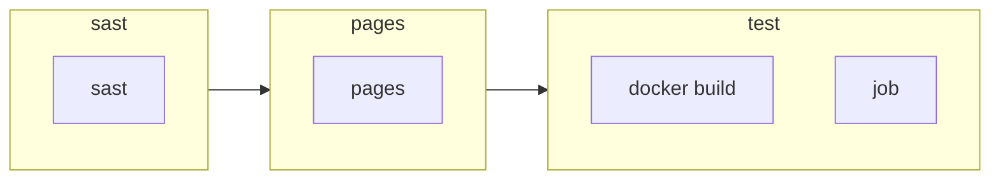

# ⚙️ Gitlab CI documentation generator


This is a simple script to generate a documentation for your Gitlab CI

## Usage

You must have node installed on your computer.

```bash
npm install
npm run build
npm run start -i <input file> -o <output file>
```

## Input file

The input file must be a valid yaml file.  
You can find an example in the `example` directory.

## Output file

The output file is a `md` file.  
You can find a generated example in the `example` directory.

## Acknowledgments

Project made during the [Nuit de l'info 2022](https://www.nuitdelinfo.com/).

* [Gitlab CI documentation](https://docs.gitlab.com/ce/ci/yaml/README.html) for the yaml schema

---

## Demo

### Input file

<details>
<summary>Open</summary>

```yaml
stages:
- sast
- pages

workflow:
  name: 'Pipeline for branch: $CI_COMMIT_BRANCH'

variables:
  DEPLOY_SITE: "https://example.com/"
  DEPLOY_ENVIRONMENT:
    description: "The deployment target. Change this variable to 'canary' or 'production' if needed."
    value: "staging"

# SAST (Code & dependency check)
sast:
  stage: sast
include:
  - template: Security/SAST.gitlab-ci.yml
  - project: 'my-group/my-project'
    file: '/templates/.gitlab-ci-template.yml'
  - project: 'my-group/my-subgroup/my-project-2'
    file:
      - '/templates/.builds.yml'
      - '/templates/.tests.yml'
  - remote: 'https://gitlab.com/example-project/-/raw/main/.gitlab-ci.yml'
default:
  image: ruby:3.0
  timeout: 3 hours 30 minutes
  interruptible: true
  before_script:
    - npm install
  retry:
    max: 2
    when: runner_system_failure
  artifacts:
    paths:
      - public/
      - public/
    exclude:
      - binaries/**/*.o
    expire_in: 1 week
    expose_as: 'artifact 1'
    name: "job1-artifacts-file"
    public: false
    reports:
      awd: rspec.xml
      awdawd: rspec.xml
    untracked: true
    when: on_failure
  cache:
    key: binaries-cache
    paths:
      - binaries/*.apk
      - .config

# Build website
pages:
  stage: pages
  image: node:lts
  before_script:
    - npm install
  script:
    - npm run build
    - rm -r public/
    - cp -r build/ public/
    - echo $CI_PAGES_URL
  artifacts:
    paths:
      - public/
      - public/
    exclude:
      - binaries/**/*.o
    expire_in: 1 week
    expose_as: 'artifact 1'
    name: "job1-artifacts-file"
    public: false
    reports:
      awd: rspec.xml
      awdawd: rspec.xml
    untracked: true
    when: on_failure
  rules:
    - if: $CI_COMMIT_REF_NAME == "main"
    - if: $CI_COMMIT_REF_NAME == "main"
  environment:
    name: production
    kubernetes:
      namespace: production
      deployment: website
      service: website
  needs:
    - project: namespace/group/project-name
      job: build-1
      ref: main
      artifacts: true
    - project: namespace/group/project-name-2
      job: build-2
      ref: main
      artifacts: true

docker build:
  script: docker build -t my-image:$CI_COMMIT_REF_SLUG .
  rules:
    - if: $CI_PIPELINE_SOURCE == "merge_request_event"
      changes:
        paths:
          - Dockerfile
          - Dockerfile
        compare_to: 'refs/heads/branch1'


job:
  variables:
    DEPLOY_VARIABLE: "default-deploy"
  coverage: '/Code coverage: \d+\.\d+/'
  rules:
    - if: $CI_COMMIT_REF_NAME == $CI_DEFAULT_BRANCH
      when: manual
      changes:
        - Dockerfile
      variables:                              # Override DEPLOY_VARIABLE defined
        DEPLOY_VARIABLE: "deploy-production"  # at the job level.
    - if: $CI_COMMIT_REF_NAME =~ /feature/
      when: never
      variables:
        IS_A_FEATURE: "true"                  # Define a new variable.
      changes:
        paths:
          - Dockerfile
    - exists:
        - Dockerfile
  script:
    - echo "Run script with $DEPLOY_VARIABLE as an argument"
    - echo "Run another script if $IS_A_FEATURE exists"

```

</details>

### Result

<details>
<summary>Open</summary>

# Pipeline for branch: $CI_COMMIT_BRANCH
## 📥 Includes
| Type | Value |
| --- | --- |
|  | Security/SAST.gitlab-ci.yml |
|  | my-group/my-project |
|  | my-group/my-subgroup/my-project-2 |
|  | https://gitlab.com/example-project/-/raw/main/.gitlab-ci.yml |

## 🌍 Default properties
    
## Artifacts
 

**✅ Paths:** `public/`, `public/`

**❌ Exclude:** `binaries/**/*.o`

**⌚ Expire in:** `1 week`

**📊 Reports:** awd: `rspec.xml`, awdawd: `rspec.xml`

## Cache
| Key | Paths | Untracked | Policy | When |
| --- | --- | --- | --- | --- |
|  | `binaries/*.apk`, `.config` | ❌ |  |  |
## Before scripts
```bash
npm install
```

## 📑 Variables

| Name | Value | Description |
|------|-------|-------------|
| `DEPLOY_SITE` | `https://example.com/` |  |
| `DEPLOY_ENVIRONMENT` | `staging` | The deployment target. Change this variable to 'canary' or 'production' if needed. |

## 📊 Workflow overview

## 📃 Stages
## ⚙️ sast

<details>
<summary><h3>sast</h3></summary>


</details>

## ⚙️ pages

<details>
<summary><h3>pages</h3></summary>


#### Before Scripts
```bash
npm install
```
#### Scripts
```bash
npm run build
rm -r public/
cp -r build/ public/
echo $CI_PAGES_URL
```


#### Artifacts
 

**✅ Paths:** `public/`, `public/`

**❌ Exclude:** `binaries/**/*.o`

**⌚ Expire in:** `1 week`

**📊 Reports:** awd: `rspec.xml`, awdawd: `rspec.xml`


#### Rules

| When | Condition | Allow failure | Variables | Changes | Exists |
|------|-----------|------------| ----- | ----- | ----- |
|  | `$CI_COMMIT_REF_NAME == "main"` | ❌ |  |  |  |
|  | `$CI_COMMIT_REF_NAME == "main"` | ❌ |  |  |  |


#### environment
* name: `production`
* kubernetes:
  * namespace: `production`
  * deployment: `website`
  * service: `website`


#### needs
* project: `namespace/group/project-name`
* job: `build-1`
* ref: `main`


* project: `namespace/group/project-name-2`
* job: `build-2`
* ref: `main`


</details>

## ⚙️ test

<details>
<summary><h3>docker build</h3></summary>


#### Scripts
```bash
docker build -t my-image:$CI_COMMIT_REF_SLUG .
```


#### Rules

| When | Condition | Allow failure | Variables | Changes | Exists |
|------|-----------|------------| ----- | ----- | ----- |
|  | `$CI_PIPELINE_SOURCE == "merge_request_event"` | ❌ |  | Dockerfile • Dockerfile |  |

</details>


<details>
<summary><h3>job</h3></summary>


#### Scripts
```bash
echo "Run script with $DEPLOY_VARIABLE as an argument"
echo "Run another script if $IS_A_FEATURE exists"
```

#### Variables


| Name | Value | Description |
|------|-------|-------------|
| `DEPLOY_VARIABLE` | `default-deploy` |  |


#### coverage
/Code coverage: \d+\.\d+/

#### Rules

| When | Condition | Allow failure | Variables | Changes | Exists |
|------|-----------|------------| ----- | ----- | ----- |
|  | `$CI_COMMIT_REF_NAME == $CI_DEFAULT_BRANCH` | ❌ | DEPLOY_VARIABLE: deploy-production | Dockerfile |  |
|  | `$CI_COMMIT_REF_NAME =~ /feature/` | ❌ | IS_A_FEATURE: true | Dockerfile |  |
|  | `-` | ❌ |  |  | Dockerfile |

</details>

</details>

