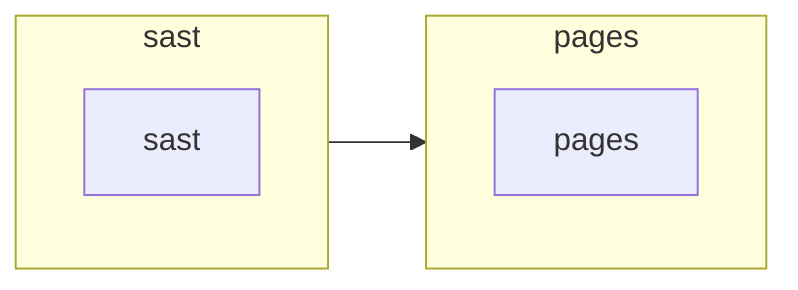

# Global Diagram

# Stages
## ⚙️ sast

<details>
<summary><h3>sast</h3></summary>


</details>

## ⚙️ pages

<details>
<summary><h3>pages</h3></summary>


#### Before Scripts
```bash
npm install
```
#### Scripts
```bash
npm run build
rm -r public/
cp -r build/ public/
echo $CI_PAGES_URL
```

</details>
