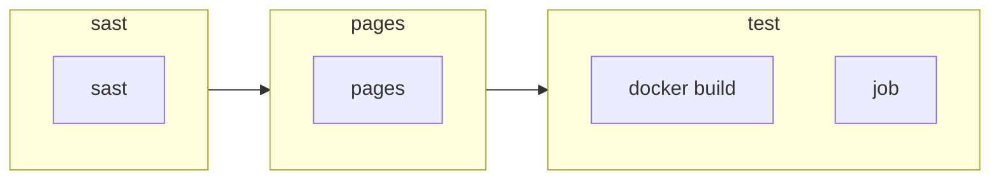

# Pipeline for branch: $CI_COMMIT_BRANCH
## 📥 Includes
| Type | Value |
| --- | --- |
|  | Security/SAST.gitlab-ci.yml |
|  | my-group/my-project |
|  | my-group/my-subgroup/my-project-2 |
|  | https://gitlab.com/example-project/-/raw/main/.gitlab-ci.yml |

## 🌍 Default properties
     
## Artifacts
  

**✅ Paths:** `public/`, `public/`

**❌ Exclude:** `binaries/**/*.o`

**⌚ Expire in:** `1 week`

**📊 Reports:** awd: `rspec.xml`, awdawd: `rspec.xml`

## Cache
| Key | Paths | Untracked | Policy | When |
| --- | --- | --- | --- | --- |
|  | `binaries/*.apk`, `.config` | ❌ |  |  |
## Before scripts
```bash
npm install
```

## 📑 Variables

| Name | Value | Description |
|------|-------|-------------|
| `DEPLOY_SITE` | `https://example.com/` |  |
| `DEPLOY_ENVIRONMENT` | `staging` | The deployment target. Change this variable to 'canary' or 'production' if needed. |

## 📊 Workflow overview

## 📃 Stages
## ⚙️ sast

<details>
<summary><h3>sast</h3></summary>


</details>

## ⚙️ pages

<details>
<summary><h3>pages</h3></summary>

 
#### Before Scripts
```bash
npm install
```
#### Scripts
```bash
npm run build
rm -r public/
cp -r build/ public/
echo $CI_PAGES_URL
```

#### Artifacts
  

**✅ Paths:** `public/`, `public/`

**❌ Exclude:** `binaries/**/*.o`

**⌚ Expire in:** `1 week`

**📊 Reports:** awd: `rspec.xml`, awdawd: `rspec.xml`


#### Rules

| When | Condition | Allow failure | Variables | Changes | Exists |
|------|-----------|------------| ----- | ----- | ----- |
|  | `$CI_COMMIT_REF_NAME == "main"` | ❌ |  |  |  |
|  | `$CI_COMMIT_REF_NAME == "main"` | ❌ |  |  |  |


#### environment
  * name: `production`
* kubernetes:
	* namespace: `production`
	* deployment: `website`
	* service: `website`


#### needs
  * project: `namespace/group/project-name`
* job: `build-1`
* ref: `main`


* project: `namespace/group/project-name-2`
* job: `build-2`
* ref: `main`


</details>

## ⚙️ test

<details>
<summary><h3>docker build</h3></summary>


#### Scripts
```bash
docker build -t my-image:$CI_COMMIT_REF_SLUG .
```


#### Rules

| When | Condition | Allow failure | Variables | Changes | Exists |
|------|-----------|------------| ----- | ----- | ----- |
|  | `$CI_PIPELINE_SOURCE == "merge_request_event"` | ❌ |  | Dockerfile • Dockerfile |  |

</details>


<details>
<summary><h3>job</h3></summary>


#### Scripts
```bash
echo "Run script with $DEPLOY_VARIABLE as an argument"
echo "Run another script if $IS_A_FEATURE exists"
```


#### variables
  * DEPLOY_VARIABLE: `default-deploy`


#### coverage
  /Code coverage: \d+\.\d+/

#### Rules

| When | Condition | Allow failure | Variables | Changes | Exists |
|------|-----------|------------| ----- | ----- | ----- |
|  | `$CI_COMMIT_REF_NAME == $CI_DEFAULT_BRANCH` | ❌ | DEPLOY_VARIABLE: deploy-production | Dockerfile |  |
|  | `$CI_COMMIT_REF_NAME =~ /feature/` | ❌ | IS_A_FEATURE: true | Dockerfile |  |
|  | `-` | ❌ |  |  | Dockerfile |

</details>
