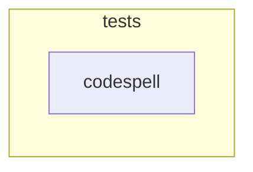

# Workflow
## 📊 Workflow overview

## 📃 Stages
## ⚙️ tests

<details>
<summary><h3>codespell</h3></summary>

 

#### Scripts
```bash
if [ ! -d ${CODESPELL_DIRECTORY} ]; then
  echo "Directory specified ${CODESPELL_DIRECTORY} does not exist, exit"
  exit 1
else
  cd ${CODESPELL_DIRECTORY}
fi

pip install -q codespell===${CODESPELL_VERSION}
IGNORE_FILES_OPTION=""
for file in ${CODESPELL_IGNORE_FILES}; do
  IGNORE_FILES_OPTION="${IGNORE_FILES_OPTION} -x $file"
done

if [ -f ${CODESPELL_DICTIONARY} ]; then
  DICTIONARY_OPTION="-I ${CODESPELL_DICTIONARY}"
else
  DICTIONARY_OPTION=""
  echo "No dictionary file found"
fi

codespell -c ${DICTIONARY_OPTION} ${IGNORE_FILES_OPTION}
```


#### variables
  * CODESPELL_DIRECTORY: `.`
* CODESPELL_DICTIONARY: `dictionary.txt`
* CODESPELL_IGNORE_FILES: ``
* CODESPELL_VERSION: `2.2.1`
* IMAGE_TAG: `3.10-alpine3.16`

</details>
